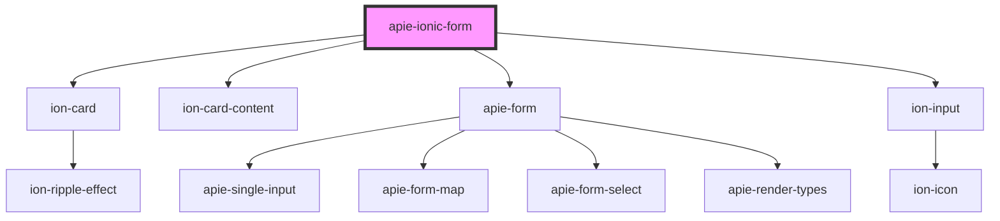

# apie-ionic-form

<!-- Auto Generated Below -->

## Properties

| Property                    | Attribute | Description | Type                                                 | Default     |
| --------------------------- | --------- | ----------- | ---------------------------------------------------- | ----------- |
| `internalState`             | --        |             | `{ [key: string]: NestedRecordField<Primitive>; }`   | `{}`        |
| `polymorphicFormDefinition` | --        |             | `{ [x: string]: string; }`                           | `undefined` |
| `validationErrors`          | --        |             | `{ [key: string]: NestedRecordField<string>; }`      | `{}`        |
| `value`                     | --        |             | `{ [key: string]: NestedRecordField<SubmitField>; }` | `{}`        |

## Dependencies

### Depends on

- ion-card
- ion-card-content
- apie-form
- ion-input

### Graph

----------------------------------------------

*Built with [StencilJS](https://stenciljs.com/)*
